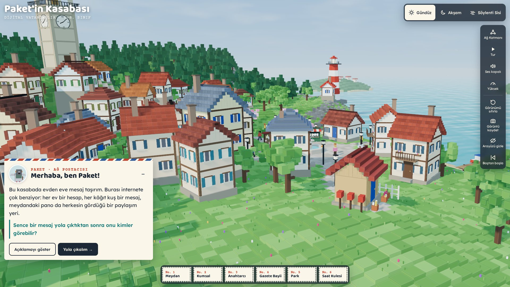

# Paket'in Kasabası

Dijital Vatandaşlık ünitesi için tarayıcıda gezilebilen 3B voksel kasaba. Rehber karakter Paket, bir posta güvercini. Öğrenci altı durakta önce gözlem yapıyor, sonra bir karar veriyor ve kasaba bu karara göre değişiyor. Puan, rozet ya da can yok.

Tek dosya: `index.html`. [promptlar/01-dijital-vatandaslik-paket-in-kasabasi.md](../../promptlar/01-dijital-vatandaslik-paket-in-kasabasi.md) promptundan üretildi.

## Nasıl açılır

- **En kolayı:** Depoda GitHub Pages açıksa `…/etkinlikler/paket-in-kasabasi/` adresi.
- **Bilgisayarda:** `index.html` dosyasını Chrome, Edge ya da Firefox ile aç. İnternet bağlantısı gerekir, çünkü 3B kütüphanesi (Three.js) `cdn.jsdelivr.net` adresinden, yazı tipleri de `fonts.googleapis.com` adresinden yüklenir.
- Okul ağı bu adresleri engelliyorsa sayfa bunu Türkçe bir mesajla söyler. BT sorumlusundan bu iki adrese izin vermesini isteyebilirsin.

## Duraklar

| No | Durak | Soru | Konu |
|----|-------|------|------|
| 1 | Kasaba Meydanı | Burada kim, neyi görebilir? | Dijital kimlik, gizlilik, kişisel bilgi |
| 2 | Kumsal | Kumdaki izler silinir mi? | Dijital ayak izi, izin almak |
| 3 | Anahtarcı Dükkânı | Hangi anahtar daha zor kopyalanır? | Güçlü parola, oltalama (sahte mektupta ipucu bulma) |
| 4 | Gazete Bayii | Bu haber nereden geldi? | Bilgi doğruluğu, kaynak kontrolü |
| 5 | Park ve Banklar | Ekranın öbür ucunda kim var? | Siber zorbalık, netiket, telif hakkı |
| 6 | Saat Kulesi | Dinlenmek de bir beceri mi? | Dijital denge; sonunda Kasaba Günlüğü açılır |

## Kontroller

- **Etrafa bakma:** Farenin sol tuşuyla sürükle. Dokunmatik ekranda tek parmakla sürükle.
- **Yakınlaştırma:** Fare tekerleği. Dokunmatik ekranda iki parmak.
- **Atmosfer (sağ üst):** Gündüz, Akşam, Söylenti Sisi.
- **Ağ Katmanı:** Mesajların yolunu ışıklı çizgilerle gösterir. Turuncu yollar herkese açık paylaşımlar, turkuaz yollar yalnızca seçilen kişilere giden mesajlar.
- **Tur:** Paket durakları sırayla gezer. Her Karar Anı'nda sınıfın seçimini bekler.
- **Ses:** Varsayılan olarak kapalıdır. Açınca dalga, martı ve kasaba sesi çalar.
- **Kalite:** Yüksek ya da Hafif. Telefonda ve zayıf donanımda Hafif mod kendiliğinden açılır.
- **Diğer düğmeler:** Görünümü sıfırla, Görüntü kaydet (öğrenci gözlem raporunda kullanabilir), Arayüzü gizle (klavyede `H`), Baştan başla.
- **Klavye:** `Alt` + `←`/`→` önceki ya da sonraki durağa gider.
- **Paket'in konuşması:** Konuşma paneli `–` düğmesiyle küçülür.
- **Hareketi azalt:** Sistemde "hareketi azalt" açıksa kanat çırpışı, kâğıt kuşların çoğalması ve kamera geçişleri sadeleşir.

Adresin sonuna `?kalite=hafif` ya da `?kalite=yuksek` eklersen kalite elle seçilir.

## Öğretmen için: metinleri değiştirmek

Paket'in bütün konuşmaları, sorular, karar seçenekleri, Paket'in yorumları ve günlük cümleleri `index.html` içindeki **`window.METINLER`** nesnesinde durur (dosyanın başından yaklaşık 230. satır). Tırnak içindeki yazıları değiştirmen yeterli. `tepki` ve `id` alanlarına dokunma; sahnedeki hareketi onlar seçiyor.

## Gizlilik

Uygulama öğrenciden ad, e-posta ya da şifre istemez ve hiçbir veri göndermez. Analitik ve çerez kullanmaz. Şifre durağında yalnızca hazır örnekler var. Kasaba Günlüğü sadece o sekmede tutulur ve sayfa yenilenince silinir.

## Test durumu

Chromium'da, yazılımsal WebGL (SwiftShader) ile otomatik tarayıcı testi yapıldı:

- **Denendi:**
  - Açılış görünümü
  - Altı durak
  - Karar Anları ve sahne tepkileri
  - Oltalama mektubundaki ipuçları
  - Üç atmosfer
  - Ağ Katmanı
  - Tur, görüntü kaydetme ve Kasaba Günlüğü
  - Hafif mod
  - 390 px genişlikte telefon yerleşimi
  - CDN'e ulaşılamadığında çıkan uyarı
- **Denenmedi:**
  - Gerçek bir akıllı tahtada ya da tablette kare hızı
  - Ses (sesi yalnızca kullanıcı açabilir)
  - Safari

Ekran görüntüleri `ekran-goruntuleri/` klasöründe.
